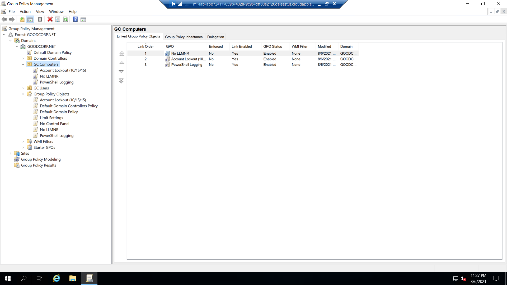
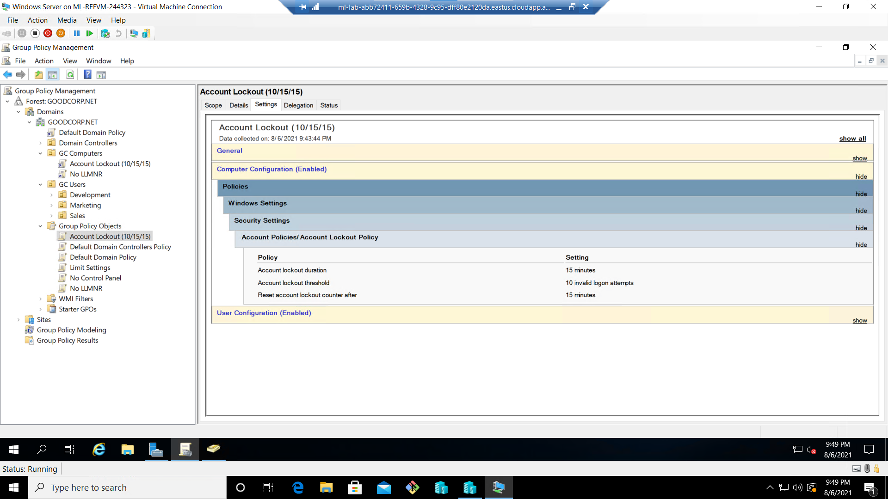
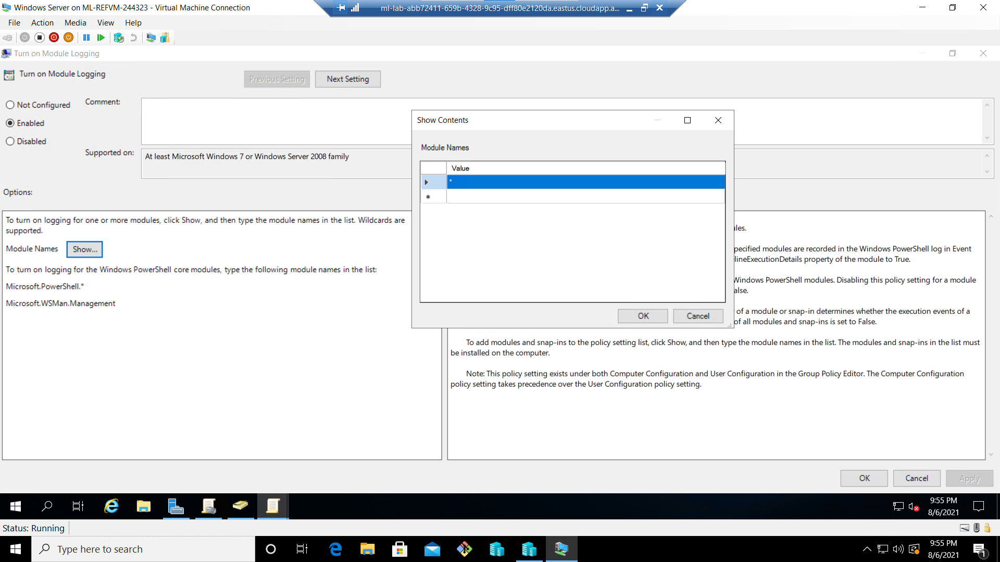
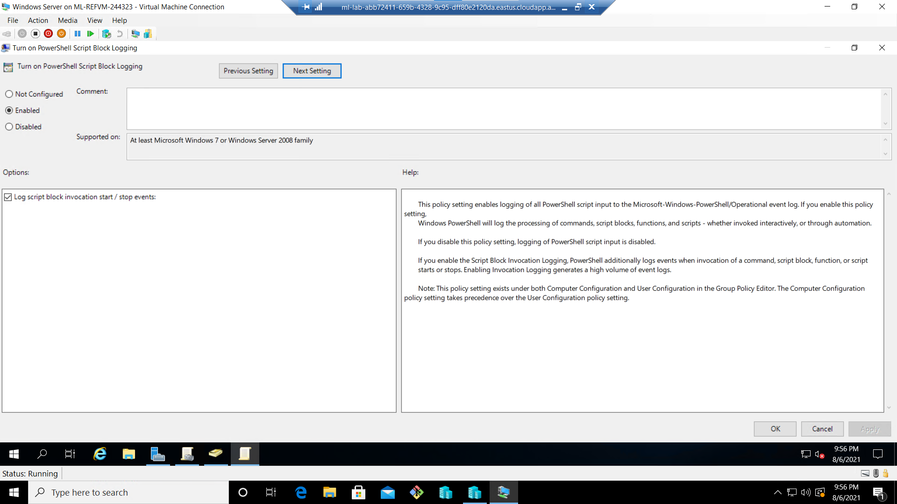
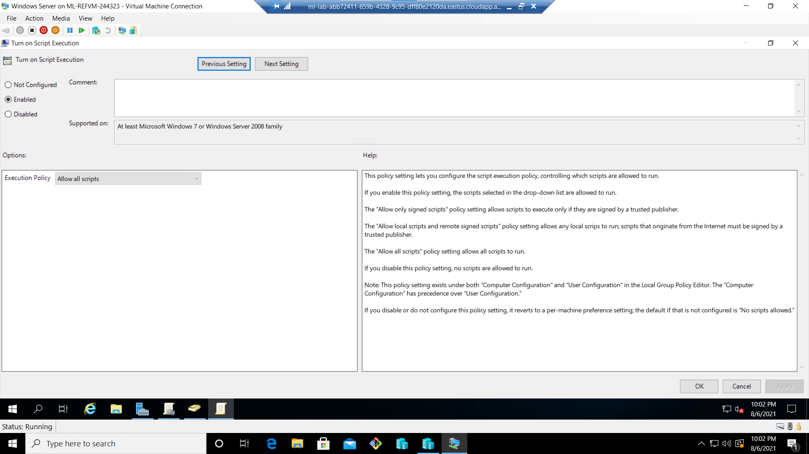
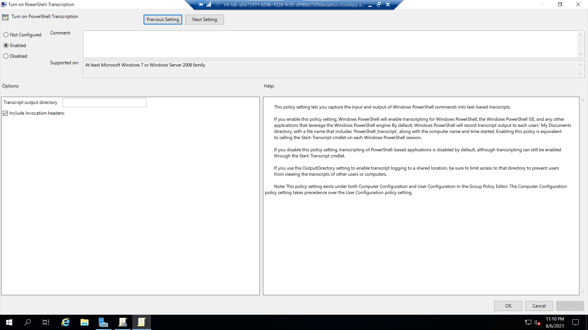

# A Day in the life of a Windows Sysadmin

This homework's deliverables were requested to be in image format. This readme simply compiles them together so they can be easily viewed as one document. The bonus powershell script and output are also appended here. 

As with Homework 03 I feel that it would have been better to compile the images below into a document like this one with more explanation as to what I was doing. Again I will leave things as close to how they were uploaded for grading.

---
---








Powershell script:

```ps
$directory = Get-ChildItem

foreach ($item in $directory){
	Get-Acl $item
}
```

Output:
```
**********************
Windows PowerShell transcript start
Start time: 20210806230720
Username: DESKTOP-SITPOTH\sysadmin
RunAs User: DESKTOP-SITPOTH\sysadmin
Configuration Name: 
Machine: DESKTOP-SITPOTH (Microsoft Windows NT 10.0.  19041.0)
Host Application:   C:\Windows\System32\WindowsPowerShell\v1. 0\powershell.exe
Process ID: 2868
PSVersion: 5.1.19041.1
PSEdition: Desktop
PSCompatibleVersions: 1.0, 2.0, 3.0, 4.0, 5.0, 5.1.  19041.1
BuildVersion: 10.0.19041.1
CLRVersion: 4.0.30319.42000
WSManStackVersion: 3.0
PSRemotingProtocolVersion: 2.3
SerializationVersion: 1.1.0.1
**********************
**********************
Command start time: 20210806230731
**********************
PS C:\Users\sysadmin> cd C:\Windows\
**********************
Command start time: 20210806230749
**********************
PS C:\Windows> C:\Users\sysadmin\Documents\enum_acls.  ps1


    Directory: C:\Windows


Path                     Owner                         Access
----                     -----                         ------
addins                   NT SERVICE\TrustedInstaller   CREATOROWNER Allow  268435456...
appcompat                NT AUTHORITY\SYSTEM           NTSERVICE\TrustedInstaller Allow  FullControl...
apppatch                 NT SERVICE\TrustedInstaller   CREATOROWNER Allow  268435456...
AppReadiness             NT AUTHORITY\SYSTEM           NTAUTHORITY\Authenticated Users Allow  Read,   Synchronize...
assembly                 BUILTIN\Administrators       BUILTIN\Administrators Allow  FullControl...
bcastdvr                 NT SERVICE\TrustedInstaller   CREATOROWNER Allow  268435456...
Boot                     NT SERVICE\TrustedInstaller   NTAUTHORITY\SYSTEM Allow  -1610612736...
Branding                 NT SERVICE\TrustedInstaller   CREATOROWNER Allow  268435456...
CbsTemp                  BUILTIN\Administrators       BUILTIN\Administrators Allow  FullControl...
Containers               NT AUTHORITY\SYSTEM           NTSERVICE\TrustedInstaller Allow  FullControl...
CSC                      NT AUTHORITY\SYSTEM           NTAUTHORITY\SYSTEM Allow  FullControl
Cursors                  NT SERVICE\TrustedInstaller   CREATOROWNER Allow  268435456...
debug                    NT AUTHORITY\SYSTEM          APPLICATION PACKAGE AUTHORITY\ALL APPLICATION   PACKAGES Deny  Fu..
diagnostics              NT SERVICE\TrustedInstaller   NTAUTHORITY\SYSTEM Allow  -1610612736...
DiagTrack                NT SERVICE\TrustedInstaller   CREATOROWNER Allow  268435456...
DigitalLocker            NT AUTHORITY\SYSTEM           NTSERVICE\TrustedInstaller Allow  FullControl...
Downloaded Program Files NT SERVICE\TrustedInstaller   CREATOROWNER Allow  268435456...
en-US                    NT SERVICE\TrustedInstaller   CREATOROWNER Allow  268435456...
Fonts                    NT SERVICE\TrustedInstaller   CREATOROWNER Allow  268435456...
GameBarPresenceWriter    NT SERVICE\TrustedInstaller   CREATOROWNER Allow  268435456...
Globalization            NT SERVICE\TrustedInstaller   CREATOROWNER Allow  268435456...
Help                     NT AUTHORITY\SYSTEM           NTSERVICE\TrustedInstaller Allow  FullControl...
IdentityCRL              NT AUTHORITY\SYSTEM           NTSERVICE\TrustedInstaller Allow  FullControl...
IME                      NT SERVICE\TrustedInstaller   CREATOROWNER Allow  268435456...
ImmersiveControlPanel    NT SERVICE\TrustedInstaller   CREATOROWNER Allow  268435456...
INF                      NT SERVICE\TrustedInstaller   CREATOROWNER Allow  268435456...
InputMethod              NT AUTHORITY\SYSTEM           NTSERVICE\TrustedInstaller Allow  FullControl...
L2Schemas                NT SERVICE\TrustedInstaller   CREATOROWNER Allow  268435456...
LiveKernelReports        NT AUTHORITY\SYSTEM           NTAUTHORITY\SYSTEM Allow  268435456...
Logs                     NT AUTHORITY\SYSTEM          BUILTIN\Administrators Allow  FullControl...
Media                    NT SERVICE\TrustedInstaller   CREATOROWNER Allow  268435456...
Microsoft.NET            NT SERVICE\TrustedInstaller   CREATOROWNER Allow  268435456...
Migration                NT AUTHORITY\SYSTEM           NTSERVICE\TrustedInstaller Allow  FullControl...
ModemLogs                NT AUTHORITY\SYSTEM           NTAUTHORITY\SYSTEM Allow  268435456...
OCR                      NT SERVICE\TrustedInstaller   NTAUTHORITY\SYSTEM Allow  -1610612736...
Offline Web Pages        NT SERVICE\TrustedInstaller   CREATOROWNER Allow  268435456...
Panther                  NT AUTHORITY\SYSTEM           NTSERVICE\TrustedInstaller Allow  FullControl...
Performance              NT SERVICE\TrustedInstaller   CREATOROWNER Allow  268435456...
PLA                      NT AUTHORITY\SYSTEM           NTSERVICE\TrustedInstaller Allow  FullControl...
PolicyDefinitions        NT SERVICE\TrustedInstaller   CREATOROWNER Allow  268435456...
Prefetch                 BUILTIN\Administrators       BUILTIN\Administrators Allow  FullControl...
PrintDialog              NT SERVICE\TrustedInstaller   CREATOROWNER Allow  268435456...
Provisioning             NT SERVICE\TrustedInstaller   CREATOROWNER Allow  268435456...
Registration             BUILTIN\Administrators        EveryoneAllow  ReadAndExecute, Synchronize...
RemotePackages           NT AUTHORITY\SYSTEM           NTAUTHORITY\Authenticated Users Allow  -1610612736..  .
rescache                 NT SERVICE\TrustedInstaller   NTAUTHORITY\SYSTEM Allow  -1610612736...
Resources                NT SERVICE\TrustedInstaller   CREATOROWNER Allow  268435456...
SchCache                 NT AUTHORITY\SYSTEM           NTSERVICE\TrustedInstaller Allow  FullControl...
schemas                  NT SERVICE\TrustedInstaller   CREATOROWNER Allow  268435456...
security                 NT SERVICE\TrustedInstaller   CREATOROWNER Allow  268435456...
ServiceProfiles          BUILTIN\Administrators        NTSERVICE\TrustedInstaller Allow  FullControl...
ServiceState             NT AUTHORITY\SYSTEM           NTAUTHORITY\SERVICE Allow  ExecuteFile...
servicing                NT SERVICE\TrustedInstaller   NTAUTHORITY\SYSTEM Allow  -1610612736...
Setup                    BUILTIN\Administrators        NTSERVICE\TrustedInstaller Allow  FullControl...
ShellComponents          NT SERVICE\TrustedInstaller   CREATOROWNER Allow  268435456...
ShellExperiences         NT SERVICE\TrustedInstaller   CREATOROWNER Allow  268435456...
SKB                      NT SERVICE\TrustedInstaller   CREATOROWNER Allow  268435456...
SoftwareDistribution     NT AUTHORITY\SYSTEM           NTSERVICE\TrustedInstaller Allow  FullControl...
Speech                   NT SERVICE\TrustedInstaller   CREATOROWNER Allow  268435456...
Speech_OneCore           NT SERVICE\TrustedInstaller   CREATOROWNER Allow  268435456...
System                   NT SERVICE\TrustedInstaller   CREATOROWNER Allow  268435456...
System32                 NT SERVICE\TrustedInstaller   CREATOROWNER Allow  268435456...
SystemApps               NT AUTHORITY\SYSTEM           NTSERVICE\TrustedInstaller Allow  FullControl...
SystemResources          NT SERVICE\TrustedInstaller   NTAUTHORITY\SYSTEM Allow  -1610612736...
SysWOW64                 NT SERVICE\TrustedInstaller   CREATOROWNER Allow  268435456...
TAPI                     NT AUTHORITY\SYSTEM           NTAUTHORITY\SYSTEM Allow  268435456...
Tasks                    NT AUTHORITY\SYSTEM           CREATOROWNER Allow  268435456...
Temp                     NT AUTHORITY\SYSTEM           CREATOROWNER Allow  268435456...
tracing                  NT AUTHORITY\SYSTEM           NTAUTHORITY\SYSTEM Allow  FullControl...
twain_32                 NT SERVICE\TrustedInstaller   CREATOROWNER Allow  268435456...
Vss                      NT AUTHORITY\SYSTEM           NTAUTHORITY\LOCAL SERVICE Allow  FullControl...
WaaS                     NT SERVICE\TrustedInstaller   NTAUTHORITY\SYSTEM Allow  -1610612736...
Web                      NT SERVICE\TrustedInstaller   CREATOROWNER Allow  268435456...
WinSxS                   NT SERVICE\TrustedInstaller   NTAUTHORITY\SYSTEM Allow  -1610612736...
bfsvc.exe                NT SERVICE\TrustedInstaller   NTAUTHORITY\SYSTEM Allow  ReadAndExecute,   Synchronize...
bootstat.dat             NT AUTHORITY\SYSTEM           NTAUTHORITY\SYSTEM Allow  FullControl...
DtcInstall.log           BUILTIN\Administrators       BUILTIN\Administrators Allow  FullControl...
EnterpriseEval.xml       BUILTIN\Administrators        NTAUTHORITY\SYSTEM Allow  FullControl...
explorer.exe             NT SERVICE\TrustedInstaller   NTAUTHORITY\SYSTEM Allow  ReadAndExecute,   Synchronize...
HelpPane.exe             NT SERVICE\TrustedInstaller   NTAUTHORITY\SYSTEM Allow  ReadAndExecute,   Synchronize...
hh.exe                   NT SERVICE\TrustedInstaller   NTAUTHORITY\SYSTEM Allow  ReadAndExecute,   Synchronize...
lsasetup.log             BUILTIN\Administrators        NTAUTHORITY\SYSTEM Allow  FullControl...
mib.bin                  NT SERVICE\TrustedInstaller   NTAUTHORITY\SYSTEM Allow  ReadAndExecute,   Synchronize...
notepad.exe              NT SERVICE\TrustedInstaller   NTAUTHORITY\SYSTEM Allow  ReadAndExecute,   Synchronize...
PFRO.log                 BUILTIN\Administrators        NTAUTHORITY\SYSTEM Allow  FullControl...
regedit.exe              NT SERVICE\TrustedInstaller   NTAUTHORITY\SYSTEM Allow  ReadAndExecute,   Synchronize...
splwow64.exe             NT SERVICE\TrustedInstaller   NTAUTHORITY\SYSTEM Allow  ReadAndExecute,   Synchronize...
system.ini               NT AUTHORITY\SYSTEM           NTAUTHORITY\SYSTEM Allow  FullControl...
twain_32.dll             NT SERVICE\TrustedInstaller   NTAUTHORITY\SYSTEM Allow  ReadAndExecute,   Synchronize...
win.ini                  NT AUTHORITY\SYSTEM           NTAUTHORITY\SYSTEM Allow  FullControl...
WindowsUpdate.log        NT AUTHORITY\SYSTEM           NTAUTHORITY\SYSTEM Allow  FullControl...
winhlp32.exe             NT SERVICE\TrustedInstaller   NTAUTHORITY\SYSTEM Allow  ReadAndExecute,   Synchronize...
WMSysPr9.prx             NT SERVICE\TrustedInstaller   NTAUTHORITY\SYSTEM Allow  ReadAndExecute,   Synchronize...
write.exe                NT SERVICE\TrustedInstaller   NTAUTHORITY\SYSTEM Allow  ReadAndExecute,   Synchronize...
```