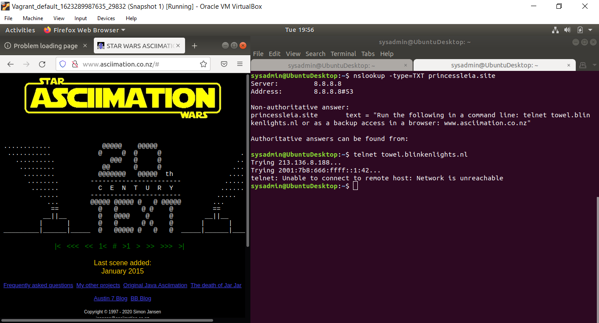

### Mission 1 ###

- `nslookup asltx.2.google.com` gives the following information:

  ```
  Server:		8.8.8.8
  Address:	8.8.8.8#53

  Non-authoritative answer:
  starwars.com	mail exchanger = 5 alt2.aspmx.l.google.com.
  starwars.com	mail exchanger = 5 alt1.aspx.l.google.com.
  starwars.com	mail exchanger = 1 aspmx.l.google.com.
  starwars.com	mail exchanger = 10 aspmx2.googlemail.com.
  starwars.com	mail exchanger = 10 aspmx3.googlemail.com.
  ```

- This shows that MX record is not set correctly, to be specific they are missing some information using only `asltx.l.google.com` and `asltx.2.google.com ` as their MX record

-  Starwars.com MX records should be configured as follows:

    ``` 
    starwars.com mail exchanger = 1 asltx.1.google.com

    starwars.com mail exchanger = 2 asltx.2.google.com
    ```

### Mission 2 ###

- `nslookup -type=TXT theforce.net` gives the following information for thforce.net mail server:

  ```
  theforce.net	text = "v=spf1 a mx mx:smtp.secureserver.net include:aspmx.googlemail.com ip4:104.156.250.80 ip4:45.63.15.159 ip4:45.63.4.215"
  ```

- This shows the current SPF reccord does not include theforce.net's new mail server **45.23.176.21**. it is still set to `include:aspmx.googlemail.com`

- Because **theforce.net** updated their mail server to **45.23.176.21** the current DNS records are not correct. this means that mail from their new server is considered untrustworthy and is blocked or sent to spam

-  In order to resolve this issue the TXT record needs to be updated as follows:

    ```
     theforce.net	text = "v=spf1 a mx mx:smtp.secureserver.net include:45-23-176-21 ip4:104.156.250.80 ip4:45.63.15.159 ip4:45.63.4.215"
     ```

### Mission 3 ###

- `nslookup -type=CNAME www.theforce.net` shows the following:

  ```
  www.theforce.net	canonical name = theforce.net
  ```

- This shows that the DNS CNAME record does not include any refrences of "resistance.theforce.net" and is therefore not being redirected to "www.theforce.net"

- to resolve this issue the a redirect should be added to the DNS record as follows:

  ```
  www.theforce.net	canonical name = theforce.net

  resistance.theforce.net conocial name = www.theforce.net
  ```

### Mission 4 ###

- `nslookup -type=NS princessleia.site` shows the current DNS servers as:

  ```
  princessleia.site	nameserver = ns25.domaincontrol.com.
  princessleia.site	nameserver = ns26.domaincontrol.com.
  ```

- Adding the backup DNS server is as easy as updating the DNS server to include:

  ```
  princessleia.site nameserver = ns25.domaincontrol.com

  princessleia.site nameserver = ns2.galaxybackup.com
  ```

### Mission 5 ###

- The shortest OSPF path from Battu to Jedha is a s follows:

  ```
  Batuu D C E F J I L Q T V Jedha
  hops  1 2 1 1 1 1 6 4 2 2 = 21 hops
  ```

- This OSPF path does not include the dreaded "Planet N" and can be used as a static route from Batuu to Jedha

### Mission 6 ###

- Opening Darkside.pcap in wireshark shows that all of their wirless traffic is encripted and a key needs to be optained

- Before attempting to find a key I would like to find the network SSID. I found this through the broadcast in packet 9. Looking in `IEEE 802.11 Wireless Management > Tagged Parameters` the SSID can be seen as `linksys`

- Next I ran `aircrack-ng -w /usr/share/wordlist/rockyou.txt ~/Homework09/Darkside.pcap` to find the decription key `dictionary`

- In wireshard I enabled deciption with the following: `Preferences > Protocols > IEEE 802.11 > Enable Decryption > Decryption Keys > Edit > wpa-pwd key=dictionary:linksys`

- Packets 312-315 a two MAC and IP addresses of note:

  ```
  00:0f:66:e3:e4:01 is at 172.16.0.1

  00:13:ce:55:98:ef is at 172.16.0.101
  ```

- looking through IP 172.16.0.101's traffic packets 62-65 also show a TCP traffic at:

  ```
  00:14:bf:0f:03:30 at 172.16.0.9
  ```

### Mission 7 ###

