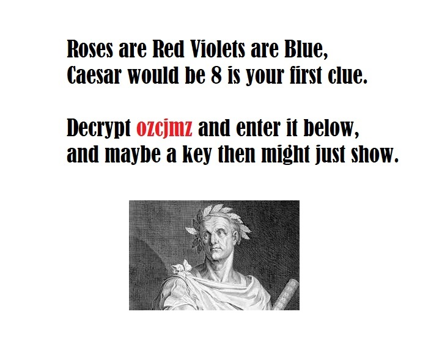
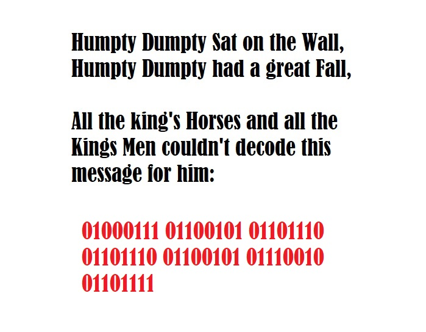
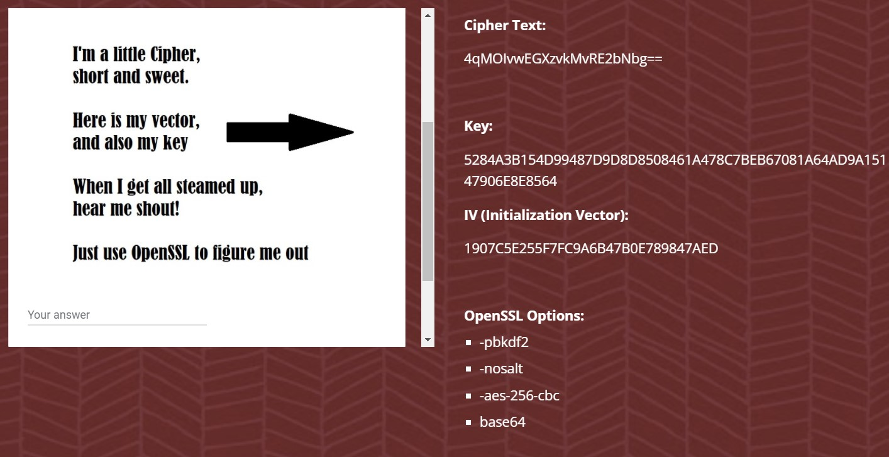
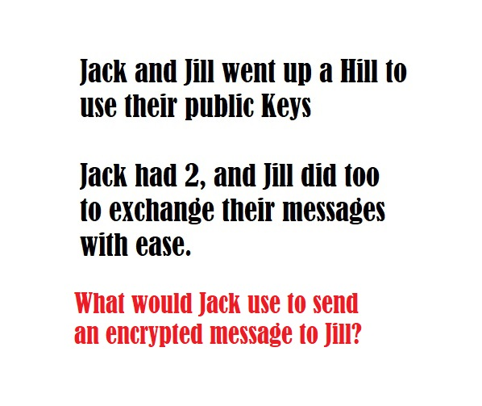
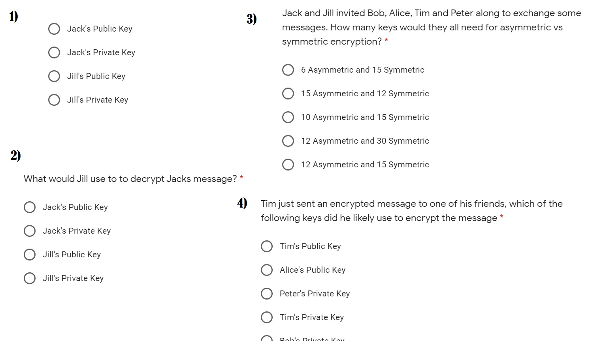
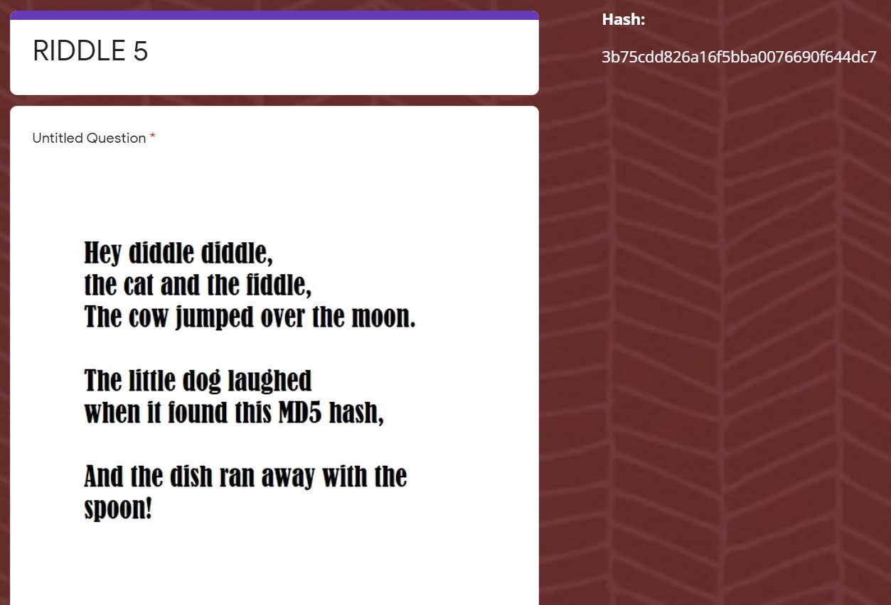
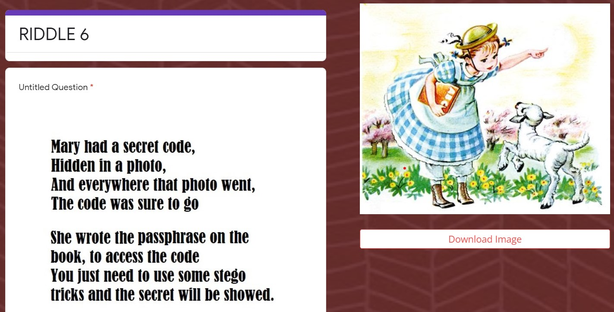
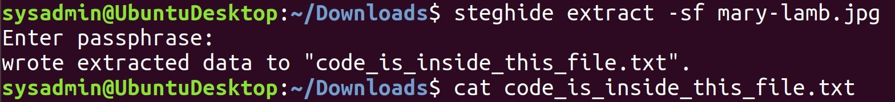
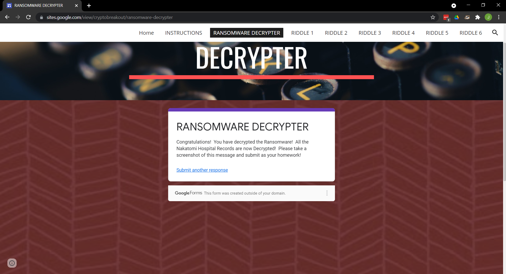

Homework 10 - Ransomware Riddles

For this homework the only deliverable I originally provided was [Sowers-10-Ransomware_Riddles.png](./Sowers-10-Ransomware_Riddles.png). While this did suffice to give me an A for the homework I feel it is insufficient as I did not provide any documentation for the steps I took to complete the homework.

Here I will redo the homework to provide more documentation. This will not be submitted for a grade, it is purely for my own reference. To indicate this I will put everything in this readme and will not convert it to `.docx` format.

---

## Riddle 1

This is a Caesar cipher with a shift of 8 letters. Decrypting "ozcjmz" either by hand or with an online tool give the answer.

## Riddle 2

This is binary that can be converted into askii to give us text to submit. I used an online tool for the conversion.

## Riddle 3

This riddle contains a cipher string that we can use `OpenSSL` to decrypt. 

To start I put the encrypted string into encrypted.text using the following command

`echo "4qMOIvwEGXzvkMvRE2bNbg==" >> encrypted.txt`

Then I used openssh to decrypt it using the information provided on the website.

`openssl enc -pbkdf2 -nosalt -aes-256-cbc -d -in encrypted.txt -out decrypted.txt -base64 -K 5284A3B154D99487D9D8D8508461A478C7BEB67081A64AD9A15147906E8E8564 -iv 1907C5E255F7FC9A6B47B0E789847AED`

The output in decrypted.txt is what we need to get the next key

## Riddle 4

This is a multiple choice riddle, I will give the answers below.

1. Jill's Public Key
2. Jill's Private Key
3. 12 Asymmetric, 15 Symmetric
4. Alice's Public Key

## Riddle 5

We had previously covered using hashcat in class but I could never get it to work with my virtual machine. It was a compatibility issue with passing through my CPU. After trying to find a workaround for a few hours I decided to use a web tool instead.

Before using a web tool I put the hash into a file with: 

`echo "3b75cdd826a16f5bba0076690f644dc7" >> hashed.txt`

The command that would have worked for hashcat is:

`hashcat -m 0 -a 0 -o solved.txt hashed.txt /usr/share/wordlists/rockyou.txt --force`

Because this is a relatively simple hash I was able to decrypt it with [md5online.org](https://md5online.org).

## Riddle 6

As indicated by the riddle, I downloaded the image and used steghide to extract hidden text. The password for the image can be seen on mary's book.

After going back to the Ransomware decrypter tab on the website and entering the keys obtained from each riddle you reach the deliverable for the homework

