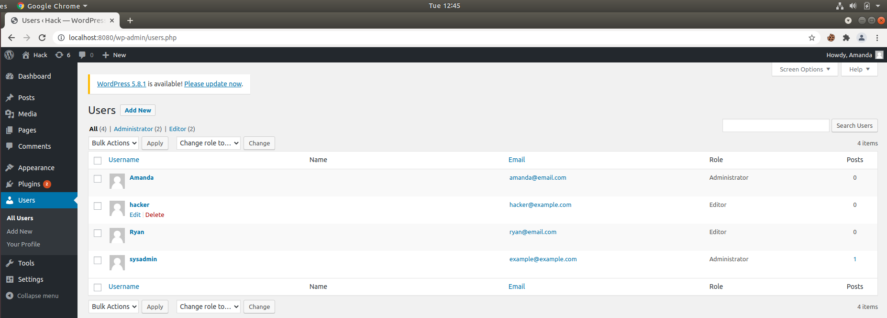
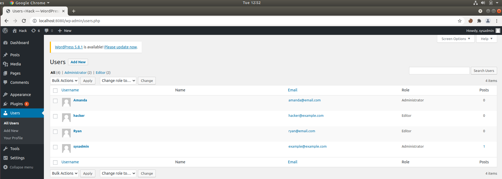
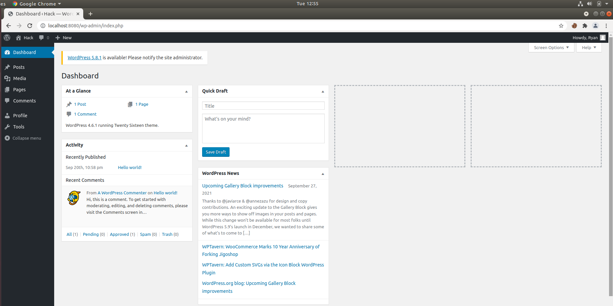
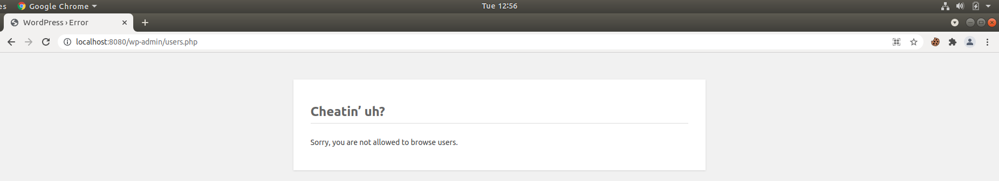
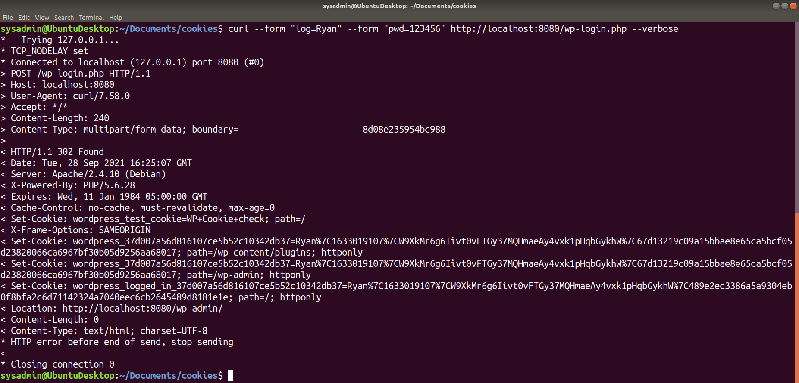
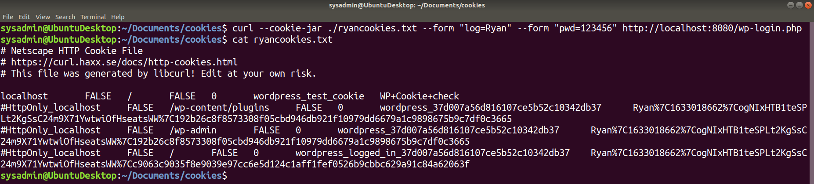
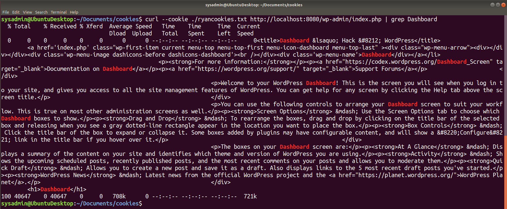
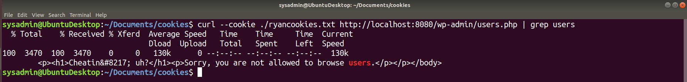

## Week 14 Homework: Web Development

#### HTTP Requests and Responses

Answer the following questions about the HTTP request and response process.

1. What type of architecture does the HTTP request and response process occur in?

    - HTTP requests occur in a **Client-Server Architecture**, which is a cycle of requests and responses between clients and servers.

2. What are the different parts of an HTTP request?

    - An HTTP request is composed of:
      - **Request Line** - query parameters
      - **Request Header** - additional details about the requested resource
      - **Request Body** - information such as login credentials or a file to be loaded
      - **Whitespace** - indicates the end of the request

3. Which part of an HTTP request is optional?

    - The **Request Body** is optional because that information is not always necessary to complete the transaction

4. What are the three parts of an HTTP response?

    - The three parts of an HTTP response are:
      - **Status Line** - gives a status code for the request (200, 404, 503, etc.)
      - **Response Header** - contains information about the server software and assigns other parameters such as cookies
      - **Response Body** - contains the requested information from the client

5. Which number class of status codes represents errors?

    - Class codes are as follows:
      - **200** - success
      - **300** - indicates multiple choices that the   server can make to respond to the request
      - **400** - indicate client errors, such as an   improperly formatted request
      - **500** - indicates server errors

6. What are the two most common request methods that a security professional will encounter?

    - The two most common request methods are **GET** and **POST**

7. Which type of HTTP request method is used for sending data?

    - **POST** requests are used to send data

8. Which part of an HTTP request contains the data being sent to the server?

    - The **Request Body** contains data being sent to the server

9. In which part of an HTTP response does the browser receive the web code to generate and style a web page?

    - The **Response Body** contains the web code to generate and style a web page

#### Using curl

Answer the following questions about `curl`:

10. What are the advantages of using `curl` over the browser?

    - `curl` has the advantage of being available in environments where a GUI is not available. Because it is a command-line tool it can also be used with other utilities such as `awk`, `grep`, and `sed`. This allows for data filtering or automation using scripts that browsers might have a difficult time reproducing. `curl` can also be used to verify that servers only respond to certain requests and are not leaking data through HTTP responses.

11. Which `curl` option is used to change the request method?

    - `curl -X` followed by POST, PUT, etc. can be used to change request methods.

12. Which `curl` option is used to set request headers?

    - `curl -H` can be used to set a request header

13. Which `curl` option is used to view the response header?

    - `curl -v` be used to show both the request and response header. `curl --head` can be used to show only the response header

14. Which request method might an attacker use to figure out which HTTP requests an HTTP server will accept?

    - An **Options** request would give the most information assuming it is allowed. After that a **GET** request would work best

#### Sessions and Cookies

Recall that HTTP servers need to be able to recognize clients from one another. They do this through sessions and cookies.

Answer the following questions about sessions and cookies:

15. Which response header sends a cookie to the client?

    ```HTTP
    HTTP/1.1 200 OK
    Content-type: text/html
    Set-Cookie: cart=Bob
    ```

    - `Set-Cookie` will send the cookie to the client

16. Which request header will continue the client's session?

    ```HTTP
    GET /cart HTTP/1.1
    Host: www.example.org
    Cookie: cart=Bob
    ```

    - `Cookie` will continue the client's section

#### Example HTTP Requests and Responses

Look through the following example HTTP request and response and answer the following questions:

**HTTP Request**

```HTTP
POST /login.php HTTP/1.1
Host: example.com
Accept-Encoding: gzip, deflate, br
Connection: keep-alive
Content-Type: application/x-www-form-urlencoded
Content-Length: 34
Upgrade-Insecure-Requests: 1
User-Agent: Mozilla/5.0 (Linux; Android 6.0; Nexus 5 Build/MRA58N) AppleWebKit/537.36 (KHTML, like Gecko) Chrome/80.0.3987.132 Mobile Safari/537.36

username=Barbara&password=password
```

17. What is the request method?

    - **POST**

18. Which header expresses the client's preference for an encrypted response?

    - `Upgrade-Insecure-Requests: 1`

19. Does the request have a user session associated with it?

    - No, this is establishing a session, a cookie will likely be sent in the response header

20. What kind of data is being sent from this request body?

    - Login credentials are being sent the the request body

**HTTP Response**

```HTTP
HTTP/1.1 200 OK
Date: Mon, 16 Mar 2020 17:05:43 GMT
Last-Modified: Sat, 01 Feb 2020 00:00:00 GMT
Content-Encoding: gzip
Expires: Fri, 01 May 2020 00:00:00 GMT
Server: Apache
Set-Cookie: SessionID=5
Content-Type: text/html; charset=UTF-8
Strict-Transport-Security: max-age=31536000; includeSubDomains
X-Content-Type: NoSniff
X-Frame-Options: DENY
X-XSS-Protection: 1; mode=block

[page content]
```

21. What is the response status code?

    - `200 OK`

22. What web server is handling this HTTP response?

    - Apache

23. Does this response have a user session associated to it?

    - Yes, `Set-Cookie: SessionID=5`

24. What kind of content is likely to be in the [page content] response body?

    - `Content-Type: text/html; charset=UTF-8`

25. If your class covered security headers, what security request headers have been included?

    - Strict transport security, or XSS protection. `Strict-Transport-Security: max-age=31536000; includeSubDomains`

#### Monoliths and Microservices

Answer the following questions about monoliths and microservices:

26. What are the individual components of microservices called?

    - **Stacks** are the components that make up microservices

27. What is a service that writes to a database and communicates to other services?

    - An **API** (Application Programming Interface) allows communication between two services

28. What type of underlying technology allows for microservices to become scalable and have redundancy?

    - **Containers** allow for several microservices   be deployed easily and consistently because they have all the necessary components needed to run a specific application packaged together.

#### Deploying and Testing a Container Set

Answer the following questions about multi-container deployment:

29. What tool can be used to deploy multiple containers at once?

    - **Docker-Compose** is currently the most popular choice, but Podman is also capable of deploying multiple containers at once through pods

30. What kind of file format is required for us to deploy a container set?

    - Both docker-compose, and podman can utilize **.yml** files to deploy container sets

#### Databases

31. Which type of SQL query would we use to see all of the information within a table called `customers`?

    - `SELECT * FROM customers;`

32. Which type of SQL query would we use to enter new data into a table? (You don't need a full query, just the first part of the statement.)

    - `INSERT INTO $table-name (column-1,...) VAlUES (value-1,...);`

33. Why would we never run `DELETE FROM <table-name>;` by itself?

    - This will delete the table itself, leaving you without any data

---

### Bonus Challenge Overview: The Cookie Jar

#### Step 1: Set Up

Create two new users: Amanda and Ryan.   

1. Navigate to `localhost:8080/wp-admin/`

2. On the left-hand toolbar, hover over **Users** and click **Add New**.

3. Enter the following information to create the new user named Amanda.

    - Username: `Amanda`
    - Email: `amanda@email.com`

4. Skip down to password:

    - Password: `password`
    - Confirm Password: Check the box to confirm use of weak password.
    - Role: `Administrator`

5. Create another user named Ryan.

    - Username: `Ryan`
    - Email: `ryan@email.com`

6. Skip down to password:

    - Password: `123456`
    - Confirm Password: Check the box to confirm use of weak password.
    - Role: `Editor`

7. Log out and log in with the following credentials:

    - Username: `Amanda`
    - Password: `password`



#### Step 2: Baselining

For these "baselining" steps, you'll want to log into two different types of accounts to see how the WordPress site looks at the `localhost:8080/wp-admin/users.php` page.  We want to see how the Users page looks from the perspective of an administrator, vs. a regular user.

1. Using your browser, log into your WordPress site as your sysadmin account and navigate to `localhost:8080/wp-admin/users.php`, where we previously created the user Ryan. Examine this page briefly. Log out.



2. Using your browser, log into your Ryan account and attempt to navigate to `localhost:8080/wp-admin/index.php`. Note the wording on your Dashboard.



3. Attempt to navigate to `localhost:8080/wp-admin/users.php`. Note what you see now.



Log out in the browser.

#### Step 3: Using Forms and a Cookie Jar

Navigate to `~/Documents` in a terminal to save your cookies.

1. Construct a `curl` request that enters two forms: `"log={username}"` and `"pwd={password}"` and goes to `http://localhost:8080/wp-login.php`. Enter Ryan's credentials where there are placeholders.



   - **Question:** Did you see any obvious confirmation of a login?

     - Yes

2. Construct the same `curl` request, but this time add the option and path to save your cookie: `--cookie-jar ./ryancookies.txt`. This option tells `curl` to save the cookies to the `ryancookies.txt` text file.



3. Read the contents of the `ryancookies.txt` file.

   - **Question:** How many items exist in this file?

     - There are three cookies in this file. The last cookie is what is keeping track of his user session

Note that each one of these is a cookie that was granted to Ryan after logging in.

#### Step 4: Log in Using Cookies

1. Craft a new `curl` command that now uses the `--cookie` option, followed by the path to your cookies file. For the URL, use `http://localhost:8080/wp-admin/index.php`.

   - `curl --cookie ./ryancookies.txt http://localhost:8080/wp-admin/index.php`

   - **Question:** Is it obvious that we can access the Dashboard?

     - Yes

2. Press the up arrow on your keyboard to run the same command, but this time, pipe `| grep Dashboard` to the end of your command to return all instances of the word `Dashboard` on the page.



  - **Question:**  Look through the output where `Dashboard` is highlighted. Does any of the wording on this page seem familiar? (Y/N) If so, you should be successfully logged in to your Editor's dashboard.

    - Yes, this looks like the standard editor's dashboard seen earlier when logging in as Ryan using a web browser. It does not contain administrative tools

#### Step 5: Test the Users.php Page

1. Finally, write a `curl` command using the same `--cookie ryancookies.txt` option, but attempt to access `http://localhost:8080/wp-admin/users.php`.



   - **Question:** What happens this time?

      - Here we see the permission denied page because Ryan does not have administrative privileges. 

---

### Submission Guidelines

* Save the file where you documented your solutions and submit it as your homework deliverable. 

---
© 2020 Trilogy Education Services, a 2U, Inc. brand. All Rights Reserved.  
