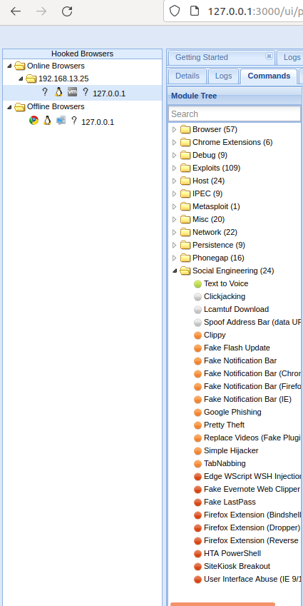

# Homework 15 - Web Vulnerabilities and Hardening

## Web Application 1: *Your Wish is My Command Injection*

1. Confirm Setup

    

2. Initial `8.8.8.8` test

    

3. Execute example command `8.8.8.8 && pwd`

    

    - Note the working directory of: `/var/www/html/vulnerabilities/exec`

4. Dot-dot-slash attack: 

    - 8.8.8.8 && cat ./../../../../../etc/passwd && cat ./../../../../../etc/hosts

    

    - Note the following command works as well, the dot-dot-slash attack is not strictly necessary with this web app's configuration: `8.8.8.8 && cat /etc/passwd && cat /etc/hosts`

5. Mitigation Strategies

    - One way to prevent this kind of attack would be to only allow specific characters to be run in the submission box such as numbers, periods, and possibly colons. Since this web tool is only supposed to be used to ping IP addresses all other characters are unnecessary. 

    - To increase security further I would add the web application to its own user group on the server side and restrict its permissions to specific commands. This allows the admins to know exactly what the web application can do.

    - Finally I would restrict the web application's access to only its file hierarchy `/vars/www/`. This way even if someone manages to use this exploit with the other security measures in place they will not be able to navigate out of the web applications folder structure and will receive a `permission denied` instead.

## Web Application 2: *A Brute Force to Be Reckoned With*

1. Confirm bWAPP configuration

    

2. Confirm invalid login message

    

3. Burp Suite Intruder

    

    

    - usernames

    
    
    - passwords

    

    - add grep matching for "success" to make it easier to find

    

    - user = tonystark | password = I am Iron Man 

    

4. Mitigation Strategies

    - To prevent this kind of attack the network should be monitored for login attempts. If there are fast, sequential login attempts for different users coming from one IP address they could be automatically forwarded the "invalid credentials" response after around 5 attempts. This will prevent the attacker from making more attempts without alerting them they have been compromised.

    - Another step to mitigate this type of attack is to have passwords expire after a set amount of time. This makes it so old, or compromised passwords will not work.

    - Lastly, prevent password reuse or passwords that are too similar to previous ones. It is common for people to want to rotate passwords because it is easier to remember them. Keeping a password history and denying previously used passwords prevents compromised passwords from coming back in rotation.

## Web Application 3: *Where's the BeEF?*

1. BeEF Success

    

2. Reading Complete!

3. Running the Exploit

    

    - script injection/hook for the web browser

    

    - BeEF control panel after successful hook

    

    - successful injection of a fake facebook notification

4. Mitigation Strategies

    - The primary mitigation technique for cross sight scripting is applying input validation code logic into the client-side or server-side code. This attack used stored XSS so the best option here is server-side input validation. This could mean that the server will not accept submitted input that includes ``. A robust validation code will also include any variations on `` such as capitalization of the whole word or specific letters.