## Week 16 Homework Submission File: Penetration Testing 1

#### Step 1: Google Dorking

- Using Google, can you identify who the Chief Executive Officer of Altoro Mutual is: **Karl Fitzgerald**

  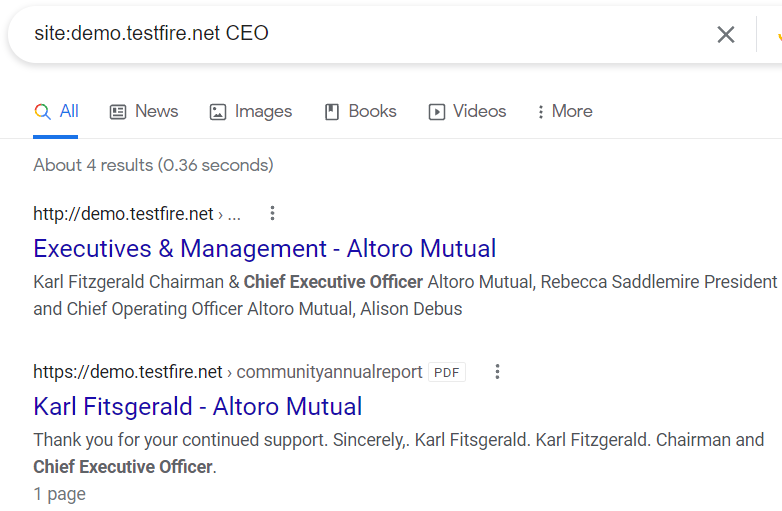

  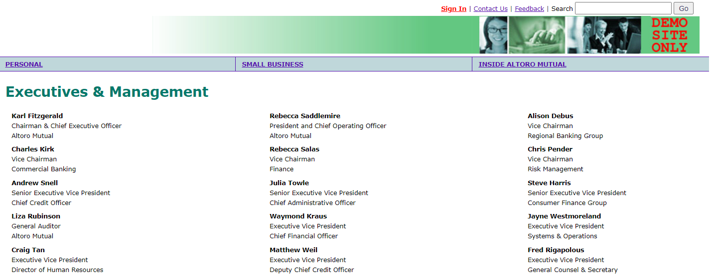

- How can this information be helpful to an attacker:

  - This information is useful because you can use the CEO's name in spoofed emails or phone calls to gain a measure of authenticity when phishing for more information or attempting to deliver a malicious payload.

#### Step 2: DNS and Domain Discovery

Enter the IP address for `demo.testfire.net` into Domain Dossier and answer the following questions based on the results:

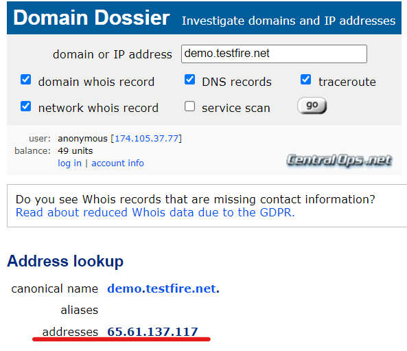

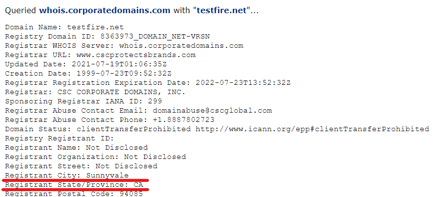

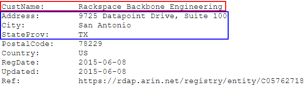

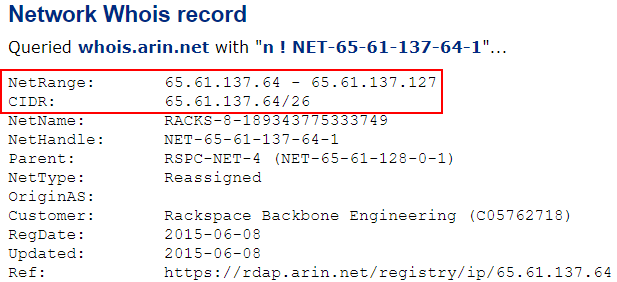

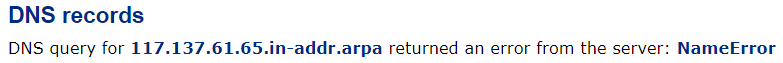

  1. Where is the company located: **The company is located in Synnyvale, CA but their servers are located in San Antonio, Texas** 

  2. What is the NetRange IP address: **65.61.137.64/26**

  3. What is the company they use to store their infrastructure: **Rackspace Backbone Engineering**

  4. What is the IP address of the DNS server: **117.137.61.65**

#### Step 3: Shodan

- What open ports and running services did Shodan find: **80, 443, 8080**

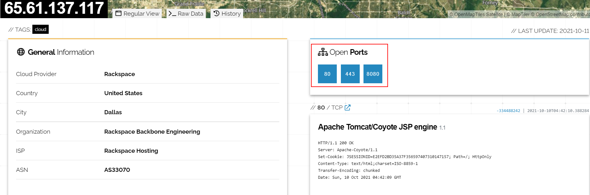

#### Step 4: Recon-ng

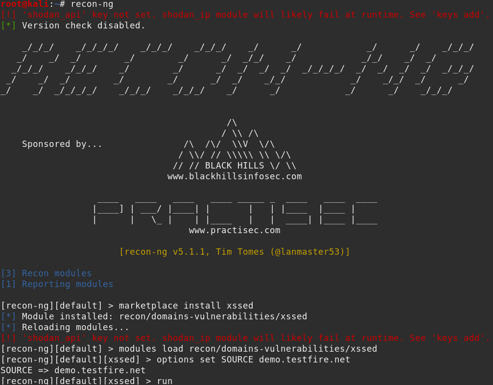

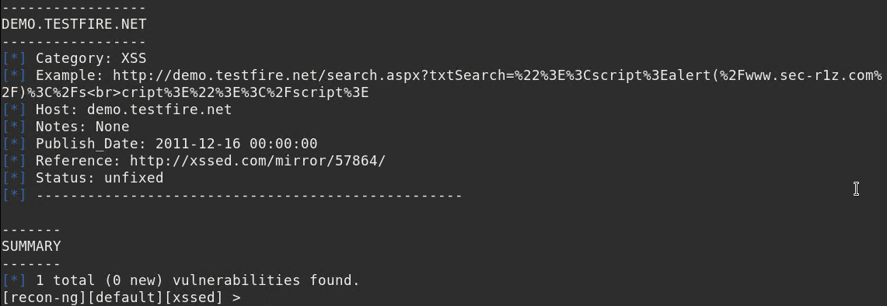

Is Altoro Mutual vulnerable to XSS: **Yes** 

### Step 5: Zenmap

Your client has asked that you help identify any vulnerabilities with their file-sharing server. Using the Metasploitable machine to act as your client's server, complete the following:

- Command for Zenmap to run a service scan against the Metasploitable machine: `nmap -sV 192.168.0.10` 
 
  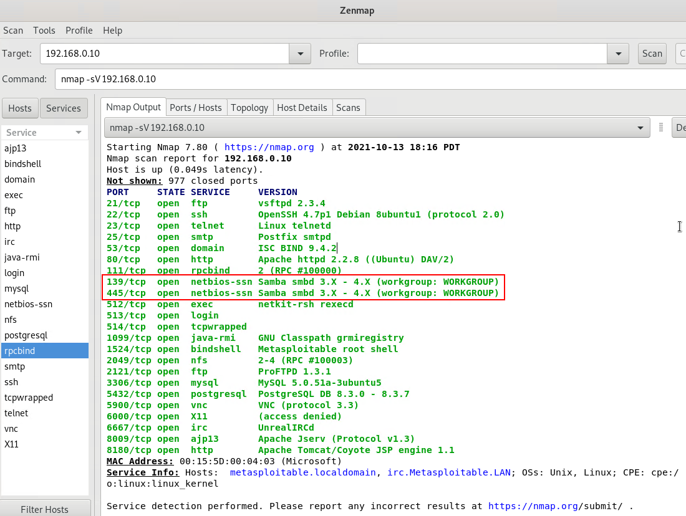

- Bonus command to output results into a new text file named: `nmap -sV -oN zenmapscan.txt 192.168.0.10`

  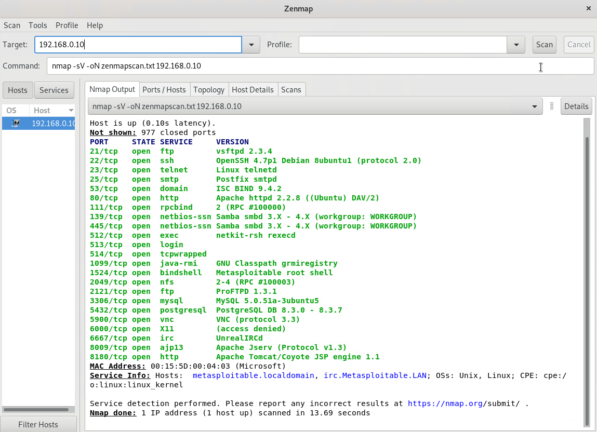

  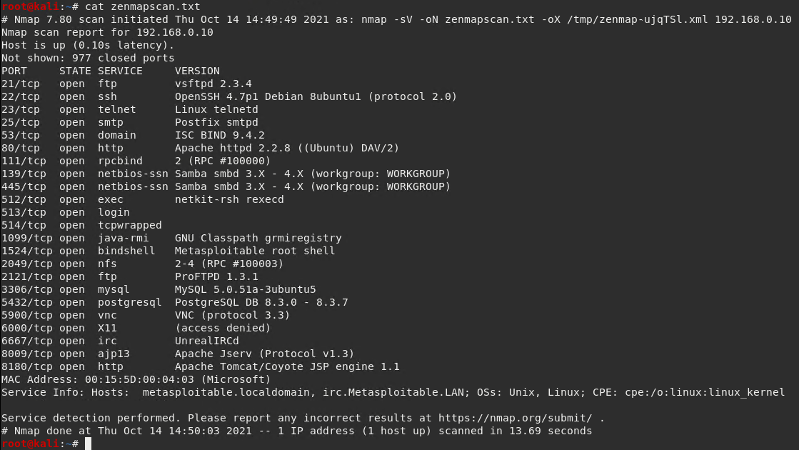

- Zenmap vulnerability script command: `nmap -script smb-enum-shares 192.168.0.10`

  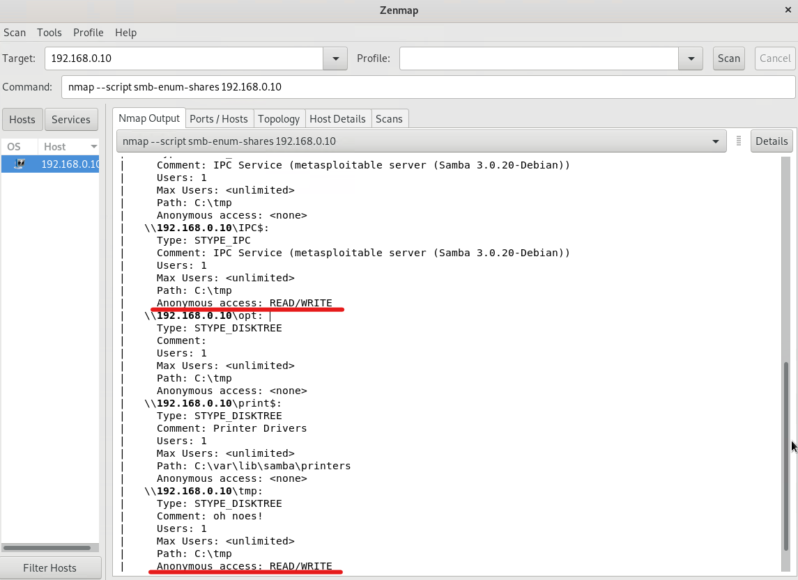

- Once you have identified this vulnerability, answer the following questions for your client:

  1. What is the vulnerability: **In the first Zenmap scan/image we can see that Samba is running an old version (3.x - 4.x) with the default workgroup name "WORKGROUP". This indicates they are using other default values and permissions.** 

  2. Why is it dangerous: **This is dangerous because this version of SAMBA (seen to be V3.0.20 specifically in the scan using smb-enum-shares script) allows anonymous users to read/write to shares without any special privileges. This could allow for data exfiltration, and the injection of malicious code to further exploit the system.**

  3. What mitigation strategies can you recommendations for the client to protect their server: **The simplest solution is to update SAMBA. This exploit has been patched in new versions. Furthermore more robust naming schemas and permissions should be implemented to prevent this type of attack if newer versions of SAMBA are found to be vulnerable to this type of attack.**

---
© 2020 Trilogy Education Services, a 2U, Inc. brand. All Rights Reserved.  

