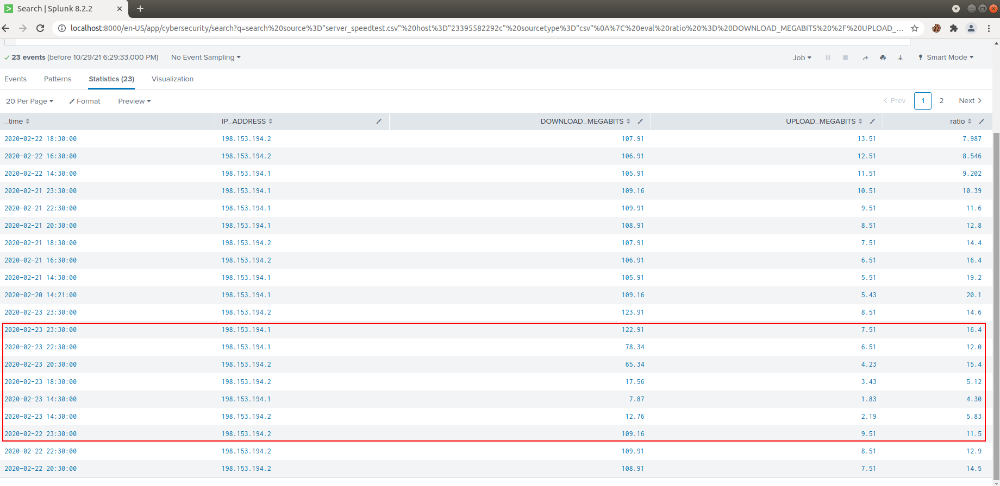
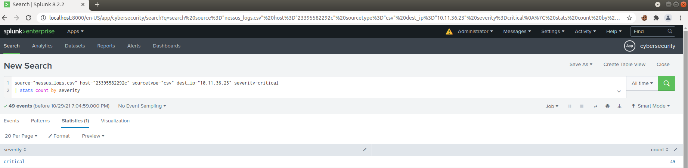
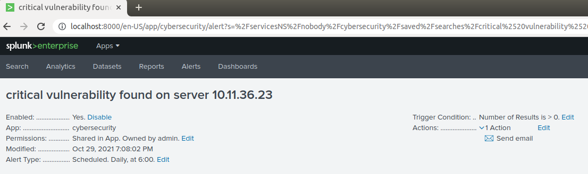
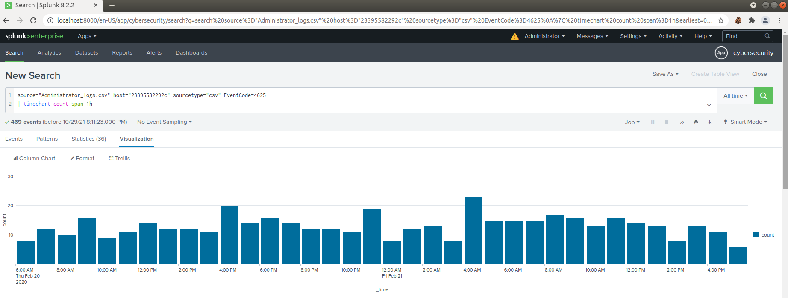
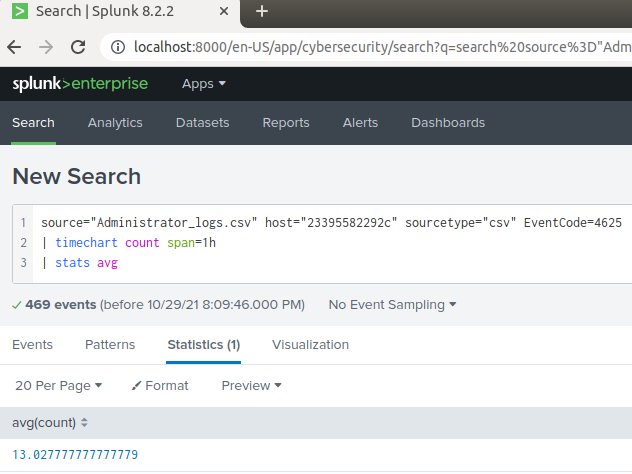
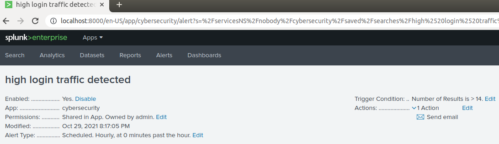

# Week 18 - SEIMS 01

## Step 1: The Need for Speed

- Use the following search to create a new `eval` field of "ratio" and build a table: 
  ```
  source="server_speedtest.csv" host="23395582292c" sourcetype="csv"
  | eval ratio = DOWNLOAD_MEGABITS / UPLOAD_MEGABITS
  | table _time IP_ADDRESS DOWNLOAD_MEGABITS UPLOAD_MEGABITS ratio
  ```

  

- Based on the report created, what is the approximate date and time of the attack?
  > We know that download and upload speeds suffer during and after DDOS attacks on Vandaly Industry's servers. We can see a noticeable drop in speeds on **February 23, 2020 around 14:30.**

- How long did it take your systems to recover?
  > Speeds did not begin to return to normal until February 23, 2020 around 22:30 indicating it took the servers about **8 hours to recover.**  

## Sep 2: Are We Vulnerable?

- The search used to find the count of vulnerabilities on server `10.11.36.23` is:
  ```
  source="nessus_logs.csv" host="23395582292c" sourcetype="csv" dest_ip="10.11.36.23" severity=critical
  | stats count by severity
  ```

  

  

## Step 3: Drawing the (base)line

- To get a baseline of how many failed logins there are start with:

  ```
  source="Administrator_logs.csv" host="23395582292c" sourcetype="csv" EventCode=4625
  | timechart count span=1h
  ```

  

  This will give the number of failed logins every hour

- Using the search below we can see there are an average of **13** failed logins per hour
  ```
  source="Administrator_logs.csv" host="23395582292c" sourcetype="csv" EventCode=4625
  | timechart count span=1h
  | stats avg 
  ```

  


- We will set an alert to check every hour if there are more than 14 failed login attempts and alert the SOC via email.

  