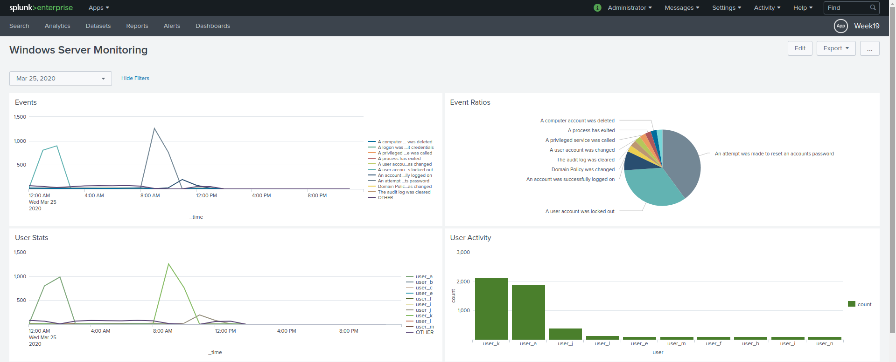
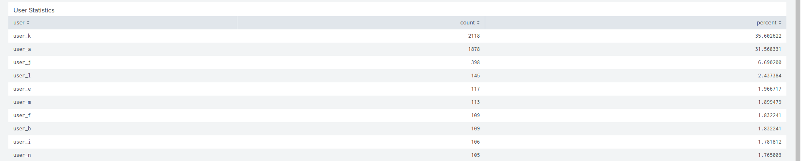
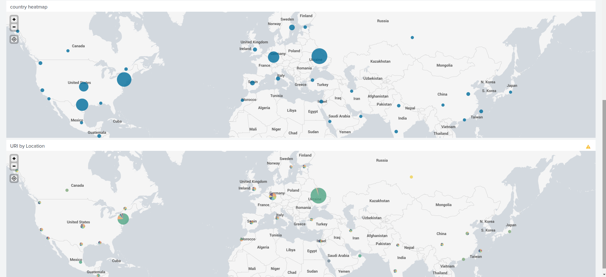
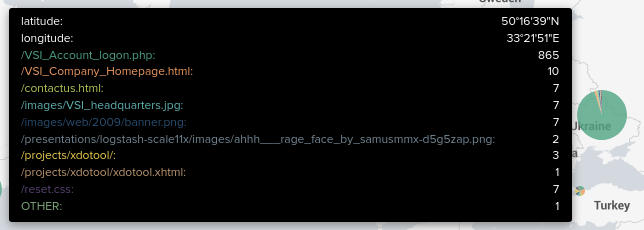

# Homework 19 - Protecting VSI from Future Attacks

## Part 1: Windows Server Attack

### Question 1

  - Several users were impacted during the attack on March 25th.
 
    > 
    > 

  - Based on the attack signatures, what mitigations would you recommend to protect each user account? Provide global mitigations that the whole company can use and individual mitigations that are specific to each user.

    > **A global mitigation strategy to prevent user lock out attacks could be to have employees log in through VPNs and block all other login attempts.** 

    > **On an individual level it may be time to address security best practices. It seems there were two users who were attacked specifically. This could  indicate their usernames were phished or reused from a personal account.**

### Question 2

  - VSI has insider information that JobeCorp attempted to target users by sending "Bad Logins" to lock out every user.

  - What sort of mitigation could you use to protect against this?

    > **As suggested above, a VPN would help mitigate this type of attack because it would allow you to block all login attempts that are not secured through the VPN.**

    > **Another possibility would be to temporarily block IP addresses that are making fast, concurrent login attempts before the user is locked out.**

---

## Part 2: Apache Webserver Attack:

### Question 1

  - Based on the geographic map, recommend a firewall rule that the networking team should implement.

  - Provide a "plain english" description of the rule.
   
    > **Block all incoming HTTP traffic where the source IP comes from the Ukraine.**
    > 
    > 

### Question 2

  - VSI has insider information that JobeCorp will launch the same webserver attack but use a different IP each time in order to avoid being stopped by the rule you just created.

  - What other rules can you create to protect VSI from attacks against your webserver?

    > **Block any IP address that attempts multiple login attempts via `VSI_Account_logon.php` in a short amount of time.**